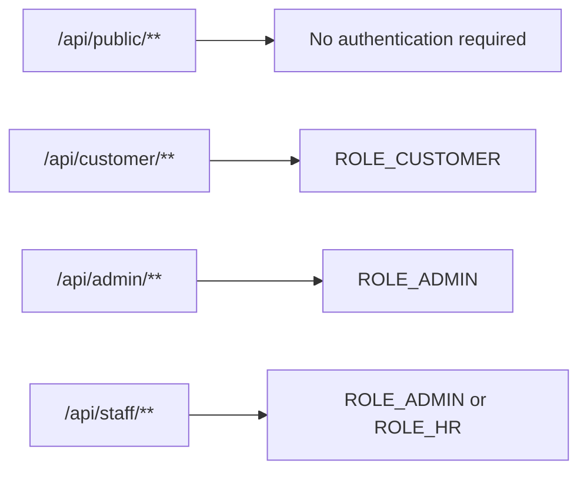
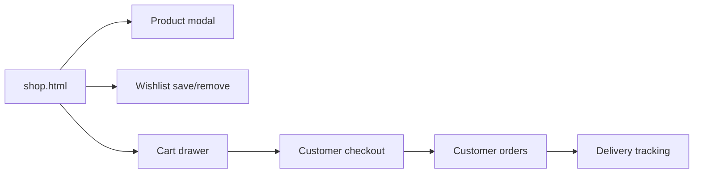
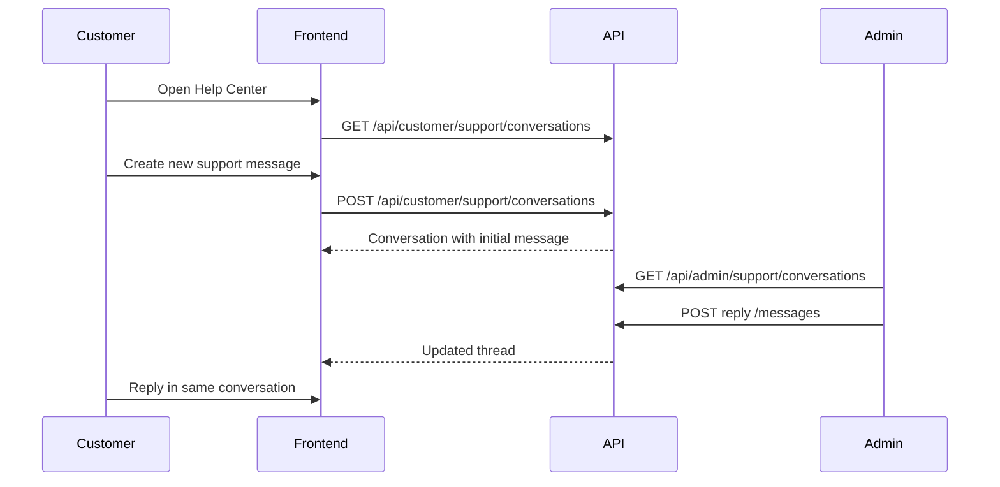
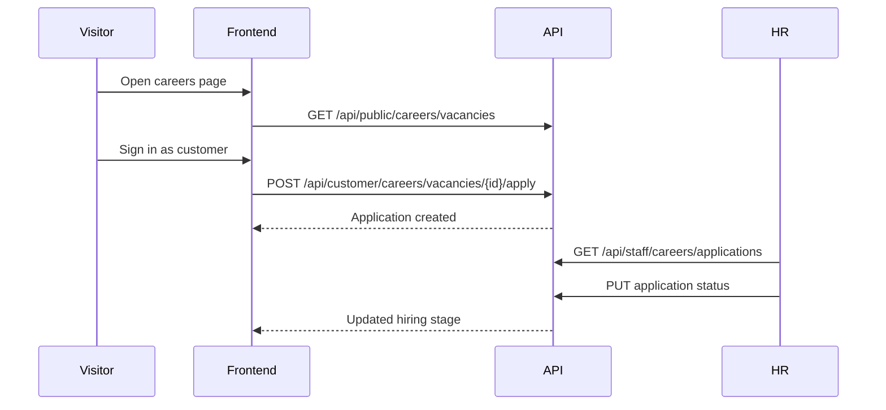
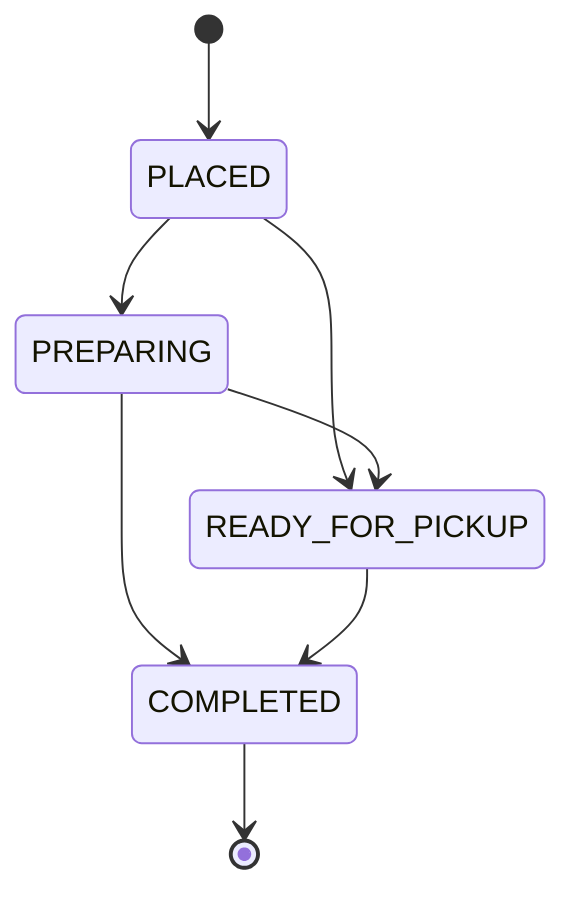
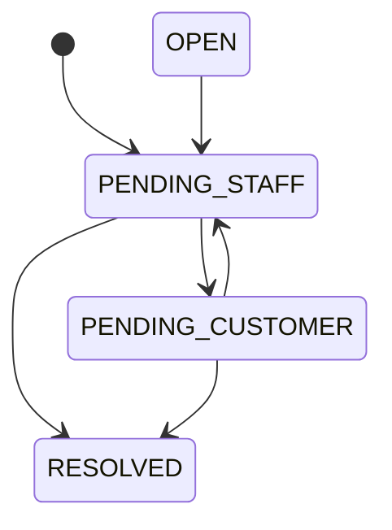
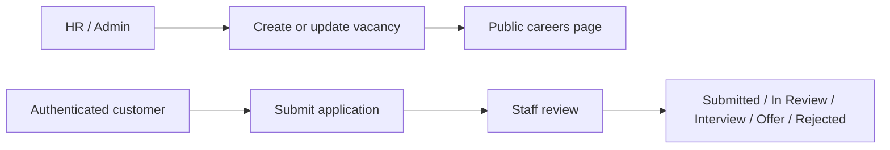
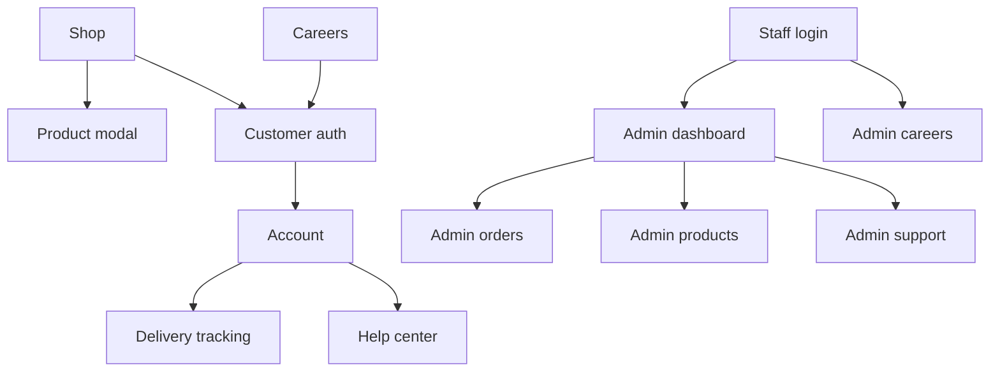

# KEFE Storefront and Operations Platform

KEFE is a full-stack commerce and operations platform built for the FHNW Internet Technology course. It combines a public storefront, customer self-service area, support inbox, live delivery tracking, careers portal, and protected staff backoffice inside one connected system.

This repository is intentionally broader than a basic CRUD webshop. It models the workflows a small but serious online business needs in order to operate end to end:

- public product discovery
- authenticated customer journeys
- inventory-aware ordering
- wishlist and review flows
- real-time catalog updates
- support conversations between customers and staff
- careers and application management

## Project Overview

KEFE is designed as a realistic small-brand storefront for self-care and wellness products. The system is split into two major halves:

- `frontend/`: static HTML, CSS, and modular vanilla JavaScript
- `backend/`: Spring Boot REST API with JPA/Hibernate, H2 persistence, JWT authentication, and seeded business data

The application supports three broad categories of usage:

- visitors browsing the shop and content pages
- customers signing in to order, review, track, and request help
- staff managing products, orders, support, and careers

## Solution Goals

The project was designed to demonstrate more than a storefront UI. Its main engineering goals are:

- model a realistic multi-role business workflow in one codebase
- separate public, customer, admin, and HR concerns cleanly
- persist business data in a relational database with meaningful entity relationships
- expose a clear REST API boundary between frontend and backend
- implement actual business rules around ordering, support, and hiring
- keep the frontend readable with framework-free, modular JavaScript
- document the system clearly enough for technical review and future extension

## What the System Covers

### Public Commerce

- Browse active products
- Filter, sort, and inspect catalog items
- View related products and review summaries
- Follow content-led discovery pages such as New Arrivals and Best Sellers
- Read legal, support, trust, and company pages

### Customer Self-Service

- Register and log in
- Maintain a profile
- Save wishlist items
- Create and manage product reviews
- Place orders
- Review order history
- Track delivery and fulfillment status
- Open support conversations and continue replies
- Apply to open vacancies

### Staff Operations

- Admin: products, categories, stock, inventory logs, orders, analytics, support inbox
- HR: careers management and application review
- Shared staff support for hiring and customer care workflows

## Core User Roles

| Role | Access |
| --- | --- |
| Public visitor | Shop, content pages, public catalog, public careers |
| Customer | Profile, wishlist, reviews, orders, delivery tracking, support, careers applications |
| Admin | Dashboard, orders, products, categories, support inbox, full store operations |
| HR | Careers management and application review |

### Access Model

### Storefront Flow

### Customer Support Flow

### Careers Flow

## Architecture

KEFE follows a layered architecture:

- static frontend pages act as the presentation layer
- JavaScript modules orchestrate client-side state and API calls
- Spring controllers expose REST endpoints
- service classes hold business logic
- repositories persist and query entities from H2

## Business Rules

### Ordering

- only active products can be ordered
- stock must be available before checkout succeeds
- order totals are calculated server-side
- order status transitions are validated
- estimated ready times are generated automatically

### Reviews and wishlist

- reviews are tied to the authenticated customer
- wishlist items are private to the authenticated customer

### Careers

- only open vacancies accept applications
- one application per customer per vacancy
- application stages are updated by staff

### Support

- support conversations belong to one customer
- only the owner can reply from the customer side
- admins manage support status and staff replies

## Data and Workflow Diagrams

### Order State Flow

### Support Status Flow

### Careers Responsibility Flow

### Page Topology

## Why This Project Is Stronger Than Basic CRUD

KEFE goes beyond “create/read/update/delete” in several important ways:

- it separates public, customer, admin, and HR concerns
- it models real workflows instead of flat records
- it includes stateful business processes like order fulfillment, support conversations, and hiring
- it documents and enforces authorization scopes
- it supports analytics and exports
- it contains a production-style content surface beyond the dashboard itself

## Current Limitations

- no external payment gateway integration
- no file upload support for CVs or attachments yet
- no email delivery service integration
- no dedicated image CMS or cloud storage workflow
- frontend is intentionally framework-free, which keeps it readable but requires more manual UI state handling

## Summary

KEFE demonstrates how a compact commerce platform can be implemented with:

- layered Spring Boot backend architecture
- JWT-protected role-based APIs
- H2 persistence with realistic seeded data
- static frontend delivery with modular JavaScript
- connected customer, admin, support, and HR workflows

