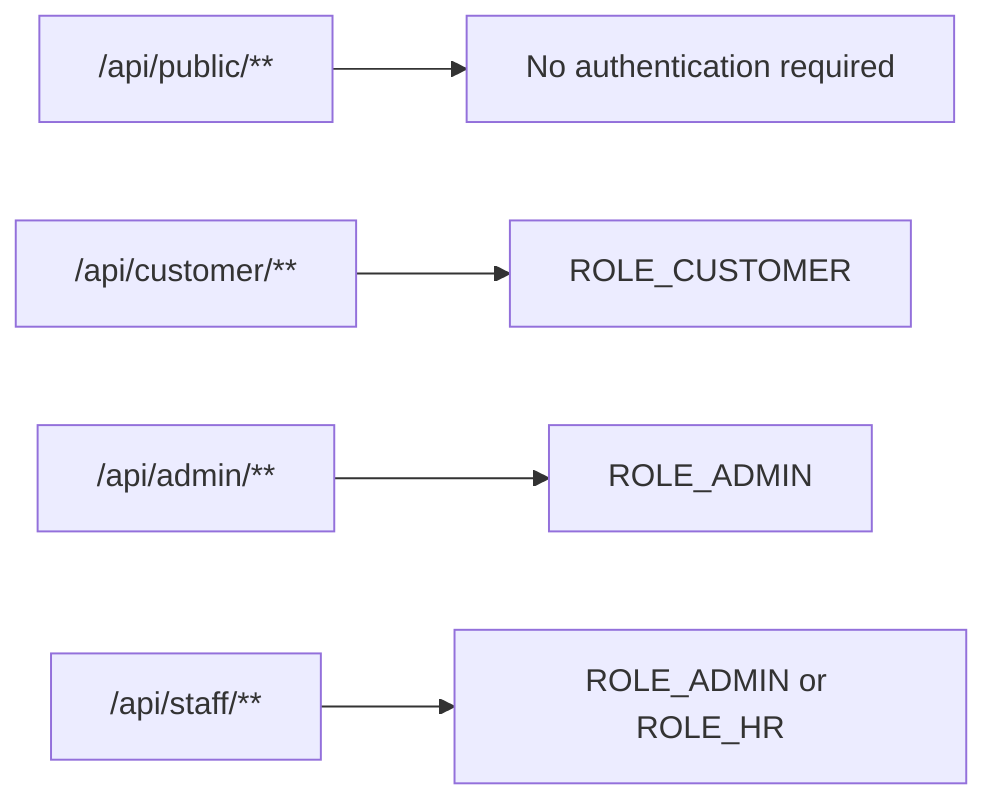
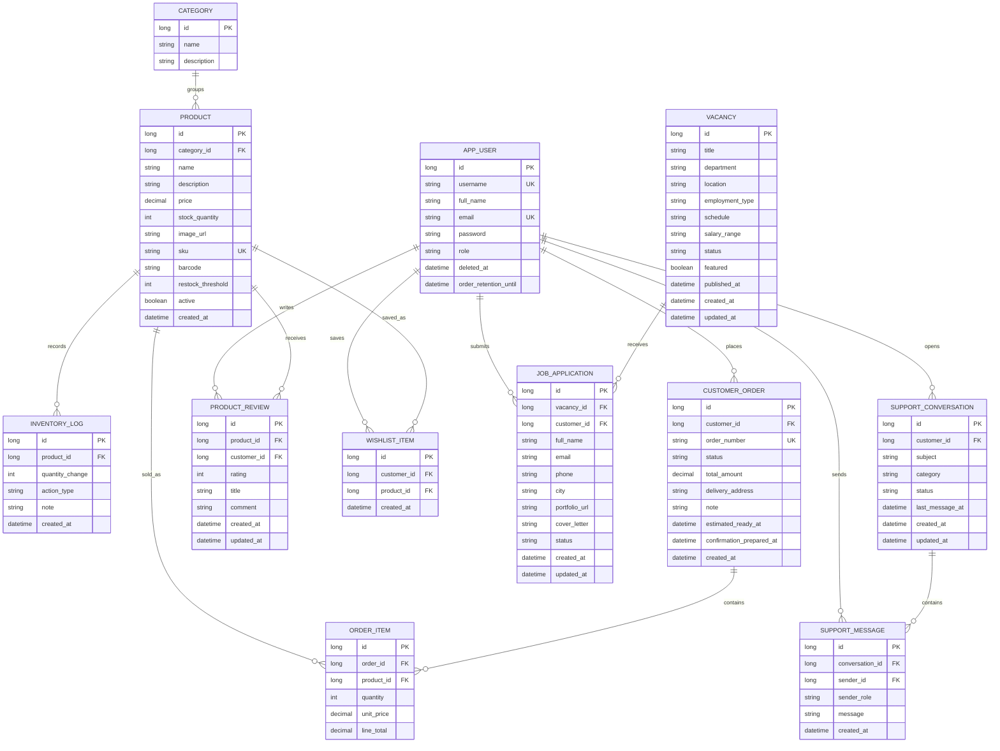
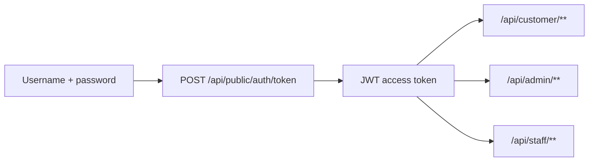
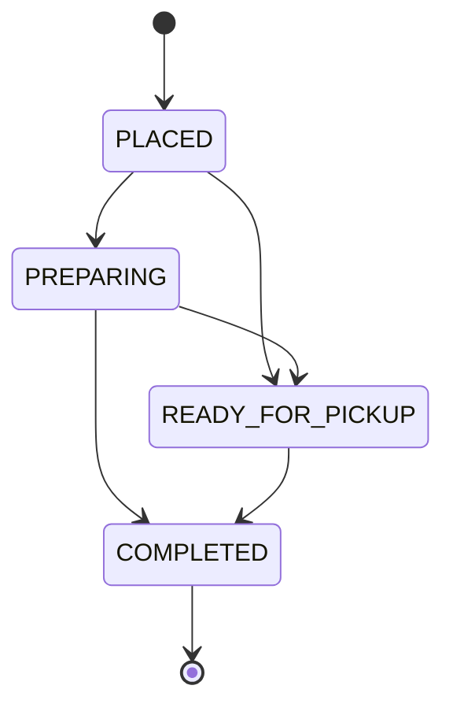
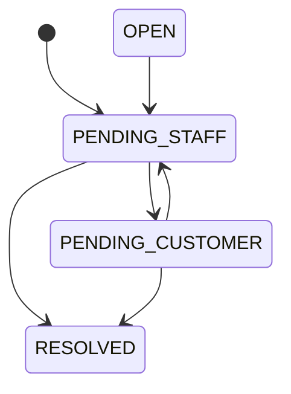
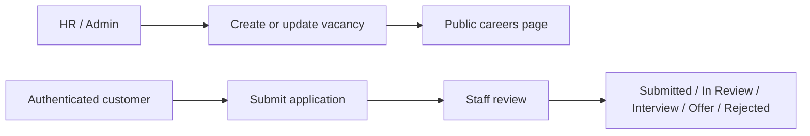

# KEFE Storefront and Operations Platform

Hello, our names are Volodymyr and Danylo, and we want to introduce you to our Internet Technology project - KEFE.
KEFE is a full-stack commerce and operations platform built for the Internet Technology course. It combines a public storefront, customer self-service area, support inbox, live delivery tracking, careers portal, and protected staff backoffice inside one connected system.

This repository is intentionally broader than a basic CRUD webshop. It models the workflows a small but serious online business needs in order to operate end to end:

- public product discovery
- authenticated customer journeys
- inventory-aware ordering
- wishlist and review flows
- real-time catalog updates
- support conversations between customers and staff
- careers and application management
- dashboard analytics and order operations

## Table of Contents

1. Project Overview
2. Solution Goals
3. What the System Covers
4. Core User Roles
5. Architecture
6. Frontend Structure
7. Backend Structure
8. Domain Model and Relational Database Design
9. Security Model
10. REST API Surface
11. Seeded Data and Local Accounts
12. Local Development Setup
13. Running the Full App
14. Key Screens and Pages
15. Business Rules
16. Data and Workflow Diagrams 
17. Validation and Error Handling
18. Current Limitations
19. Repository Structure
20. Our Contributions 

## Project Overview

KEFE is designed as a realistic small-brand storefront for self-care and wellness products. The system is split into two major halves:

- `frontend/`: static HTML, CSS, and modular vanilla JavaScript
- `backend/`: Spring Boot REST API with JPA/Hibernate, H2 persistence, JWT authentication, and seeded business data

The application supports three broad categories of usage:

- visitors browsing the shop and content pages
- customers signing in to order, review, track, and request help
- staff managing products, orders, support, and careers

## Solution Goals

The project was designed to demonstrate more than a storefront UI. Its main engineering goals are:

- model a realistic multi-role business workflow in one codebase
- separate public, customer, admin, and HR concerns cleanly
- persist business data in a relational database with meaningful entity relationships
- expose a clear REST API boundary between frontend and backend
- implement actual business rules around ordering, support, and hiring
- keep the frontend readable with framework-free, modular JavaScript
- document the system clearly enough for technical review and future extension

## What the System Covers

### Public Commerce

- Browse active products
- Filter, sort, and inspect catalog items
- View related products and review summaries
- Follow content-led discovery pages such as New Arrivals and Best Sellers
- Read legal, support, trust, and company pages

### Customer Self-Service

- Register and log in
- Maintain a profile
- Save wishlist items
- Create and manage product reviews
- Place orders
- Review order history
- Track delivery and fulfillment status
- Open support conversations and continue replies
- Apply to open vacancies

### Staff Operations

- Admin: products, categories, stock, inventory logs, orders, analytics, support inbox
- HR: careers management and application review
- Shared staff support for hiring and customer care workflows

## Core User Roles

| Role | Access |
| --- | --- |
| Public visitor | Shop, content pages, public catalog, public careers |
| Customer | Profile, wishlist, reviews, orders, delivery tracking, support, careers applications |
| Admin | Dashboard, orders, products, categories, support inbox, full store operations |
| HR | Careers management and application review |

### Access Model



## Frontend Structure

The frontend is built without a framework. This keeps the implementation transparent and makes it easy to evaluate how each flow works directly in the browser.

### Main JavaScript Modules

| File | Responsibility |
| --- | --- |
| `frontend/js/api.js` | Central API wrapper for public, customer, admin, and staff requests |
| `frontend/js/auth.js` | Session storage, login handling, redirects, role gating |
| `frontend/js/site.js` | Shared footer/nav behavior, image helpers, general UI utilities |
| `frontend/js/shop.js` | Storefront catalog, filters, modal, cart, wishlist actions |
| `frontend/js/customer.js` | Customer account profile, orders, wishlist, reviews |
| `frontend/js/admin.js` | Dashboard, products, orders, categories, inventory logs |
| `frontend/js/pages.js` | Dynamic content pages: new arrivals, best sellers, careers, help center, tracking, staff support/careers |

### Frontend Page Groups

#### Public commerce and discovery

- `shop.html`
- `new-arrivals.html`
- `best-sellers.html`
- `gift-guide.html`
- `self-care-routines.html`

#### Customer self-service

- `customer-auth.html`
- `account.html`
- `edit-account.html`
- `delivery-tracking.html`
- `help-center.html`
- `careers.html`

#### Staff backoffice

- `login.html`
- `admin-dashboard.html`
- `admin-orders.html`
- `admin-products.html`
- `categories.html`
- `product-form.html`
- `category-form.html`
- `admin-support.html`
- `admin-careers.html`

#### Trust, legal, and company pages

- `about.html`
- `brand-story.html`
- `contact.html`
- `faq.html`
- `shipping.html`
- `returns.html`
- `payment-methods.html`
- `store-policy.html`
- `cookies.html`
- `accessibility.html`
- `security.html`
- `privacy.html`
- `terms.html`
- `imprint.html`
- `press.html`
- `sustainability.html`
- `ingredient-standards.html`

## Backend Structure

### Frameworks and Libraries

- Java 17
- Spring Boot 3.3.5
- Spring Web
- Spring Validation
- Spring Data JPA
- Spring Security
- Spring OAuth2 Resource Server
- Springdoc OpenAPI / Swagger UI
- H2 database
- Hibernate ORM

### Main Backend Areas

#### Controllers

- public authentication, catalog, customer registration, and public careers
- customer account, support, careers, and orders
- admin dashboard, products, categories, orders, inventory logs, support
- staff careers endpoints for admin and HR users

#### Services

- `ProductService`
- `CustomerOrderService`
- `CustomerAccountService`
- `WishlistService`
- `ProductReviewService`
- `DashboardService`
- `CareerService`
- `SupportConversationService`
- `CatalogLiveUpdateService`

#### Persistence

- H2 file database at `backend/data/inventorydb`
- JPA entities for products, categories, users, orders, reviews, wishlist items, vacancies, applications, support conversations, and messages

## Domain Model and Relational Database Design

The data layer is intentionally relational. KEFE is not just storing flat records; it models linked business objects with explicit ownership, cardinality, and lifecycle rules.

### Logical Entity Relationship Model



### Main Entity Groups

#### Commerce

- `Product`
- `Category`
- `InventoryLog`
- `CustomerOrder`
- `OrderItem`

#### Customer account

- `AppUser`
- `WishlistItem`
- `ProductReview`

#### Careers

- `Vacancy`
- `JobApplication`
- `VacancyStatus`
- `ApplicationStatus`

#### Support

- `SupportConversation`
- `SupportMessage`
- `SupportConversationStatus`

### Physical Relational Schema

| Table | Primary Key | Important Foreign Keys | Purpose |
| --- | --- | --- | --- |
| `app_users` | `id` | none | Stores customer, admin, and HR identities plus authentication metadata |
| `categories` | `id` | none | Top-level catalog grouping |
| `products` | `id` | `category_id -> categories.id` | Product master data, price, stock, visibility, SKU/barcode |
| `inventory_logs` | `id` | `product_id -> products.id` | Historical stock change records |
| `customer_orders` | `id` | `customer_id -> app_users.id` | Order header, lifecycle status, delivery address, timing |
| `order_items` | `id` | `order_id -> customer_orders.id`, `product_id -> products.id` | Order line items with snapshot pricing |
| `product_reviews` | `id` | `product_id -> products.id`, `customer_id -> app_users.id` | Customer-authored review content and rating |
| `wishlist_items` | `id` | `customer_id -> app_users.id`, `product_id -> products.id` | Saved products for a customer |
| `vacancies` | `id` | none | Career openings published by staff |
| `job_applications` | `id` | `vacancy_id -> vacancies.id`, `customer_id -> app_users.id` | One customer application per vacancy |
| `support_conversations` | `id` | `customer_id -> app_users.id` | Customer-owned help threads |
| `support_messages` | `id` | `conversation_id -> support_conversations.id`, `sender_id -> app_users.id` | Individual messages inside a support thread |

### Key Relational Constraints

| Constraint | Meaning |
| --- | --- |
| unique username and email in `app_users` | Identity must be stable and non-duplicated |
| unique SKU in `products` | Product references remain operationally unique |
| unique `(product_id, customer_id)` in `product_reviews` | One review per customer per product |
| unique `(product_id, customer_id)` in `wishlist_items` | One wishlist save per customer/product pair |
| unique `(vacancy_id, customer_id)` in `job_applications` | One application per customer per vacancy |
| mandatory FK from `products` to `categories` | Every product belongs to a category |
| mandatory FK from `order_items` to order and product | Every line item belongs to one order and references one product |
| mandatory FK from `support_messages` to conversation and sender | Every message belongs to one thread and one user |

### Database Design Notes

- The schema is normalized around core business aggregates instead of duplicating customer or product data across unrelated tables.
- Product, order, support, and careers flows are separated into their own subdomains but connected through `app_users`.
- Order items persist price-at-time-of-order, which protects reporting and customer history from later catalog price changes.
- Inventory logs preserve stock movement history instead of only storing the latest stock value.
- Support conversations and support messages separate thread metadata from message history, which keeps inbox filtering efficient while preserving complete timelines.
- Careers uses dedicated vacancy and application tables rather than overloading generic content or contact forms.

### Persistence Strategy

- relational database: H2 file-based database
- ORM: Hibernate via Spring Data JPA
- schema update strategy: `spring.jpa.hibernate.ddl-auto=update`
- compatibility handling: startup compatibility logic upgrades legacy local schemas for newer fields and roles

## Security Model

Authentication is JWT-based. The frontend stores the token in `localStorage` and includes it through the shared API wrapper for protected calls.

### Protected Scope Rules

- public routes: no token required
- customer routes: `ROLE_CUSTOMER`
- admin routes: `ROLE_ADMIN`
- staff routes: `ROLE_ADMIN` or `ROLE_HR`

### Authentication Flow



## REST API Surface

This is a functional overview rather than a full OpenAPI dump.

### Public

- `POST /api/public/auth/token`
- `POST /api/public/customers/register`
- `GET /api/public/products`
- `GET /api/public/products/new-arrivals`
- `GET /api/public/products/{id}`
- `GET /api/public/products/{id}/related`
- `GET /api/public/products/{id}/reviews`
- `GET /api/public/categories`
- `GET /api/public/careers/vacancies`

### Customer

- `GET/PUT/DELETE /api/customer/me`
- `GET/POST/DELETE /api/customer/wishlist`
- `GET/PUT/DELETE /api/customer/reviews`
- `GET /api/customer/orders`
- `GET /api/customer/orders/{orderNumber}`
- `POST /api/customer/orders`
- `GET/POST /api/customer/support/conversations`
- `POST /api/customer/support/conversations/{conversationId}/messages`
- `GET /api/customer/careers/applications`
- `POST /api/customer/careers/vacancies/{vacancyId}/apply`

### Admin

- `GET /api/admin/dashboard/stats`
- `GET /api/admin/dashboard/insights`
- `GET /api/admin/dashboard/export.csv`
- product CRUD under `/api/admin/products`
- category CRUD under `/api/admin/categories`
- inventory logs under `/api/admin/inventory-logs`
- order management under `/api/admin/orders`
- support inbox under `/api/admin/support/conversations`

### Staff

- `GET /api/staff/careers/vacancies`
- `POST /api/staff/careers/vacancies`
- `PUT /api/staff/careers/vacancies/{id}`
- `GET /api/staff/careers/applications`
- `GET /api/staff/careers/vacancies/{vacancyId}/applications`
- `PUT /api/staff/careers/applications/{applicationId}/status`

Swagger UI is available locally at:

- [http://localhost:8080/swagger-ui.html](http://localhost:8080/swagger-ui.html)

## Seeded Data and Local Accounts

The backend seeds realistic product, order, support, and careers data at startup.

### Seeded staff accounts

| Role | Username | Password |
| --- | --- | --- |
| Admin | `admin` | `admin123` |
| HR | `hr` | `hr123` |

### Seeded customer account

| Role | Username | Password |
| --- | --- | --- |
| Customer | `lina` | `customer123` |

### Seeded business data

- 65+ live catalog products
- customer order history with delivery status
- open vacancies
- existing job applications
- support conversations and message threads
- dashboard-ready inventory and sales data

## Local Development Setup

### Prerequisites

- Java 17+
- Maven 3.9+
- any static file server for the frontend

### Backend configuration

The backend uses the following defaults:

- server port: `8080`
- H2 database: `jdbc:h2:file:./data/inventorydb`
- Swagger UI: `/swagger-ui.html`
- H2 console: `/h2-console`

See `backend/src/main/resources/application.properties` for current defaults.

### Frontend configuration

The frontend reads the API base URL from a meta tag and works with the backend at `http://localhost:8080` by default.

## Running the Full App

### 1. Start the backend

```bash
cd /*your path*/inventory-management-system/backend
mvn spring-boot:run
```

### 2. Serve the frontend

Use VS Code Live Server or any static server from the `frontend/` directory.

Example:

```bash
cd /*your path*/inventory-management-system/frontend
python3 -m http.server 5500
```

### 3. Open the main entry points

- Storefront: [http://localhost:5500/shop.html](http://localhost:5500/shop.html)
- Customer login: [http://localhost:5500/customer-auth.html](http://localhost:5500/customer-auth.html)
- Staff login: [http://localhost:5500/login.html](http://localhost:5500/login.html)
- Swagger: [http://localhost:8080/swagger-ui.html](http://localhost:8080/swagger-ui.html)

## Key Screens and Pages

### Commerce

- `shop.html`: main storefront with filtering, cart, wishlist, and modal details
- `new-arrivals.html`: newest products from live catalog data
- `best-sellers.html`: live best-seller shortlist

### Customer

- `account.html`: orders, wishlist, reviews, account summary
- `delivery-tracking.html`: status timeline from real customer order data
- `help-center.html`: threaded support conversations
- `careers.html`: live vacancies plus one-per-vacancy application flow

### Staff

- `admin-dashboard.html`: operational analytics and summary cards
- `admin-orders.html`: order workflow management
- `admin-products.html`: product editing and stock operations
- `admin-support.html`: support ticket list, status changes, reply workflow
- `admin-careers.html`: vacancy creation and application review

## Business Rules

### Ordering

- only active products can be ordered
- stock must be available before checkout succeeds
- order totals are calculated server-side
- order status transitions are validated
- estimated ready times are generated automatically

### Reviews and wishlist

- reviews are tied to the authenticated customer
- wishlist items are private to the authenticated customer

### Careers

- only open vacancies accept applications
- one application per customer per vacancy
- application stages are updated by staff

### Support

- support conversations belong to one customer
- only the owner can reply from the customer side
- admins manage support status and staff replies

## Data and Workflow Diagrams

### Order State Flow



### Support Status Flow



### Careers Responsibility Flow



## Validation and Error Handling

The backend includes:

- bean validation on request DTOs
- service-layer business validation exceptions
- not-found handling
- centralized error response formatting through a global exception handler

The frontend includes:

- message boxes for success and error states
- role-aware redirects
- hidden/visible state handling for authenticated pages

## Current Limitations

- no external payment gateway integration
- no file upload support for CVs or attachments yet
- no email delivery service integration
- no dedicated image CMS or cloud storage workflow
- frontend is intentionally framework-free, which keeps it readable but requires more manual UI state handling

## Repository Structure

```text
inventory-management-system/
├── .gitignore
├── README.md
├── backend/
│   ├── pom.xml
│   ├── data/
│   └── src/
│       ├── main/
│       │   ├── java/com/example/inventory/
│       │   │   ├── InventoryManagementApplication.java
│       │   │   ├── config/
│       │   │   │   ├── DataInitializer.java
│       │   │   │   ├── OpenApiConfig.java
│       │   │   │   └── SecurityConfig.java
│       │   │   ├── controller/
│       │   │   │   ├── AdminCategoryController.java
│       │   │   │   ├── AdminDashboardController.java
│       │   │   │   ├── AdminInventoryLogController.java
│       │   │   │   ├── AdminOrderController.java
│       │   │   │   ├── AdminProductController.java
│       │   │   │   ├── AdminSupportController.java
│       │   │   │   ├── CustomerAccountController.java
│       │   │   │   ├── CustomerCareerController.java
│       │   │   │   ├── CustomerSupportController.java
│       │   │   │   ├── PublicAuthController.java
│       │   │   │   ├── PublicCareerController.java
│       │   │   │   ├── PublicCatalogController.java
│       │   │   │   ├── PublicCustomerController.java
│       │   │   │   └── StaffCareerController.java
│       │   │   ├── dto/
│       │   │   │   ├── AdminOrderResponse.java
│       │   │   │   ├── AdminOrderStatusUpdateRequest.java
│       │   │   │   ├── AuthTokenRequest.java
│       │   │   │   ├── AuthTokenResponse.java
│       │   │   │   ├── CategoryRequest.java
│       │   │   │   ├── CategoryResponse.java
│       │   │   │   ├── CustomerCheckoutItemRequest.java
│       │   │   │   ├── CustomerCheckoutRequest.java
│       │   │   │   ├── CustomerOrderItemResponse.java
│       │   │   │   ├── CustomerOrderResponse.java
│       │   │   │   ├── CustomerProfileResponse.java
│       │   │   │   ├── CustomerProfileUpdateRequest.java
│       │   │   │   ├── CustomerRegisterRequest.java
│       │   │   │   ├── DashboardAlertResponse.java
│       │   │   │   ├── DashboardCategorySalesResponse.java
│       │   │   │   ├── DashboardInsightsResponse.java
│       │   │   │   ├── DashboardStatsResponse.java
│       │   │   │   ├── InventoryLogResponse.java
│       │   │   │   ├── JobApplicationRequest.java
│       │   │   │   ├── JobApplicationResponse.java
│       │   │   │   ├── JobApplicationStatusUpdateRequest.java
│       │   │   │   ├── ProductRequest.java
│       │   │   │   ├── ProductResponse.java
│       │   │   │   ├── ProductReviewRequest.java
│       │   │   │   ├── ProductReviewResponse.java
│       │   │   │   ├── StockUpdateRequest.java
│       │   │   │   ├── SupportConversationRequest.java
│       │   │   │   ├── SupportConversationResponse.java
│       │   │   │   ├── SupportConversationStatusUpdateRequest.java
│       │   │   │   ├── SupportMessageRequest.java
│       │   │   │   ├── SupportMessageResponse.java
│       │   │   │   ├── VacancyRequest.java
│       │   │   │   ├── VacancyResponse.java
│       │   │   │   └── WishlistItemResponse.java
│       │   │   ├── exception/
│       │   │   │   ├── ApiError.java
│       │   │   │   ├── BusinessValidationException.java
│       │   │   │   ├── GlobalExceptionHandler.java
│       │   │   │   └── ResourceNotFoundException.java
│       │   │   ├── model/
│       │   │   │   ├── AppUser.java
│       │   │   │   ├── ApplicationStatus.java
│       │   │   │   ├── Category.java
│       │   │   │   ├── CustomerOrder.java
│       │   │   │   ├── InventoryActionType.java
│       │   │   │   ├── InventoryLog.java
│       │   │   │   ├── JobApplication.java
│       │   │   │   ├── OrderItem.java
│       │   │   │   ├── OrderStatus.java
│       │   │   │   ├── Product.java
│       │   │   │   ├── ProductReview.java
│       │   │   │   ├── SupportConversation.java
│       │   │   │   ├── SupportConversationStatus.java
│       │   │   │   ├── SupportMessage.java
│       │   │   │   ├── UserRole.java
│       │   │   │   ├── Vacancy.java
│       │   │   │   ├── VacancyStatus.java
│       │   │   │   └── WishlistItem.java
│       │   │   ├── repository/
│       │   │   │   ├── AppUserRepository.java
│       │   │   │   ├── CategoryRepository.java
│       │   │   │   ├── CustomerOrderRepository.java
│       │   │   │   ├── InventoryLogRepository.java
│       │   │   │   ├── JobApplicationRepository.java
│       │   │   │   ├── ProductRepository.java
│       │   │   │   ├── ProductReviewRepository.java
│       │   │   │   ├── SupportConversationRepository.java
│       │   │   │   ├── SupportMessageRepository.java
│       │   │   │   ├── VacancyRepository.java
│       │   │   │   └── WishlistItemRepository.java
│       │   │   └── service/
│       │   │       ├── AppUserDetailsService.java
│       │   │       ├── AuthService.java
│       │   │       ├── CareerService.java
│       │   │       ├── CatalogLiveUpdateService.java
│       │   │       ├── CategoryService.java
│       │   │       ├── CustomerAccountService.java
│       │   │       ├── CustomerOrderService.java
│       │   │       ├── DashboardService.java
│       │   │       ├── InventoryLogService.java
│       │   │       ├── ProductReviewService.java
│       │   │       ├── ProductService.java
│       │   │       ├── SupportConversationService.java
│       │   │       └── WishlistService.java
│       │   └── resources/
│       │       └── application.properties
│       └── test/
│           └── java/com/example/inventory/
│               ├── AdminOrderControllerIntegrationTest.java
│               └── CustomerExperienceIntegrationTest.java
└── frontend/
    ├── about.html
    ├── accessibility.html
    ├── account.html
    ├── admin-careers.html
    ├── admin-dashboard.html
    ├── admin-orders.html
    ├── admin-products.html
    ├── admin-support.html
    ├── assets/
    │   └── images/
    │       ├── coffee-dark.svg
    │       ├── coffee.svg
    │       ├── groovy-dark.svg
    │       ├── groovy.svg
    │       ├── laying-dark.svg
    │       ├── laying.svg
    │       ├── levitate-dark.svg
    │       ├── levitate.svg
    │       ├── loving-dark.svg
    │       ├── loving.svg
    │       ├── petting-dark.svg
    │       ├── petting.svg
    │       ├── plant-dark.svg
    │       ├── plant.svg
    │       ├── reading-side-dark.svg
    │       ├── reading-side.svg
    │       ├── rolling-dark.svg
    │       ├── rolling.svg
    │       ├── selfie-dark.svg
    │       ├── selfie.svg
    │       ├── sitting-reading-dark.svg
    │       └── sitting-reading.svg
    ├── best-sellers.html
    ├── brand-story.html
    ├── careers.html
    ├── categories.html
    ├── category-form.html
    ├── contact.html
    ├── cookies.html
    ├── css/
    │   └── style.css
    ├── customer-auth.html
    ├── delivery-tracking.html
    ├── edit-account.html
    ├── faq.html
    ├── gift-guide.html
    ├── help-center.html
    ├── imprint.html
    ├── ingredient-standards.html
    ├── js/
    │   ├── admin.js
    │   ├── api.js
    │   ├── auth.js
    │   ├── customer.js
    │   ├── pages.js
    │   ├── shop.js
    │   └── site.js
    ├── login.html
    ├── new-arrivals.html
    ├── payment-methods.html
    ├── press.html
    ├── privacy.html
    ├── product-form.html
    ├── returns.html
    ├── security.html
    ├── self-care-routines.html
    ├── shipping.html
    ├── shop.html
    ├── store-policy.html
    ├── sustainability.html
    └── terms.html
```

## Our Contributions

As a team of two people most of the project is a shared work. The split below reflects primary ownership for some topics — both of us reviewed each other's code. Other features were a shared effort.

Volodymyr - Authentification, access control and design.

Responsible for the security model and the overall look and feel. Implemented JWT-based authentication (AuthService, AppUserDetailsService, PublicAuthController) including token issuing and validation, and configured role-based access scoping in SecurityConfig across the public, customer, admin and HR route groups. Built the user and role model (AppUser, UserRole) and customer registration. On the frontend, designed the full visual system in style.css and the shared layout, navigation and footer (site.js), handled session storage, login redirects and role gating (auth.js), and built the customer self-service pages (customer-auth.html, account.html, edit-account.html).

Danylo - Business logic, inventory and store operations.

Responsible for the data model and the business layer of the application. This included designing the JPA entities and their relationships for the commerce side (Product, Category, InventoryLog, CustomerOrder, OrderItem) and the relational schema around them. Implemented the core service logic in ProductService, CustomerOrderService, CategoryService, InventoryLogService and DashboardService, including the ordering rules. Built the inventory tracking — stock movement logs, restock thresholds — and the admin-facing views for it on the product and dashboard screens, plus the dashboard analytics and csv exploriation. 

Shared work

As a small team it was not only possible but very convenient to work together on most parts of the project.This includes: the support and careers subsystems, backend services and their entities, frontend pages and flows, debugging.